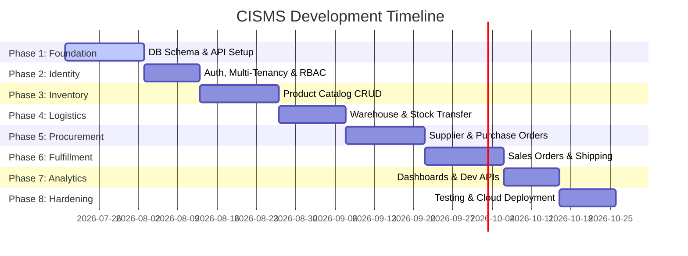

# Cloud Inventory & Supply Chain Management System (CISMS)
## Development Phases & Implementation Roadmap

This document outlines the systematic, phased implementation strategy for building the **Cloud Inventory & Supply Chain Management System (CISMS)**. The phases are structured to follow a logical development flow, starting from database foundational models, progressing through security and core CRUD modules, and culminating in advanced analytics, developer APIs, and production deployment.

---

## 🗺️ High-Level Project Roadmap

---

## 📋 Summary of Development Phases

| Phase | Title | Focus Area | Key Deliverables |
| :---: | :--- | :--- | :--- |
| **1** | [Foundation & Setup](#phase-1-foundation-db-schema--environment-setup) | Infra, DB, CI/CD | PostgreSQL schema, Docker environments, Dev server |
| **2** | [Auth & Security](#phase-2-identity-multi-tenancy--rbac-authorization) | Multi-tenancy & RBAC | JWT Auth, 4-tier RBAC, audit log engine |
| **3** | [Product Catalog](#phase-3-product-catalog--inventory-management) | Core CRUD Module 1 | SKU database, Category Tree, Barcode integration |
| **4** | [Warehouse Management](#phase-4-warehouse-locations--stock-transfers) | Core CRUD Module 3 | Location hierarchy (Warehouse $\rightarrow$ Bin), Stock heatmaps |
| **5** | [Supplier Procurement](#phase-5-supplier-procurement--purchase-orders) | Core CRUD Module 2 | Supplier onboarding, PO lifecycle, Goods Receipt Notes (GRN) |
| **6** | [Order Fulfillment](#phase-6-customer-sales-orders--shipping-fulfillment) | Core CRUD Module 4 | Sales Orders, Pick/Pack lists, Return management (RMA) |
| **7** | [Analytics & APIs](#phase-7-analytics-dashboards--developer-platform) | Reporting & Open API | Real-time dashboards, WebSockets, API Key management |
| **8** | [Hardening & Release](#phase-8-hardening-security-audits--cloud-deployment) | QA, Perf, Devops | Load testing, Security audit, Production deployment |

---

## 🛠️ Detailed Breakdown of Phases

### Phase 1: Foundation, DB Schema & Environment Setup
Establish the development sandbox, design the relational database blueprints, and deploy the core container infrastructure.

- [ ] **Infrastructure Setup**
  - Configure `docker-compose.yml` defining the services: Backend API, PostgreSQL database, and Redis cache.
  - Setup ESLint/Prettier (or Flutter Lints/Analysis Rules) and pre-commit hooks to enforce code standards.
- [ ] **Database Schema Initialization**
  - Design migration scripts for foundational tables with proper relational constraints, foreign key indexes, and audit columns (`created_at`, `updated_at`, `deleted_at`).
  - Configure PostgreSQL schemas to handle soft-deletion cleanly across all tables.
- [ ] **API Gateway & Routing Foundation**
  - Create the skeleton server structure using structured folders (Clean Architecture / Controller-Service-Repository pattern).
  - Setup centralized error-handling middlewares and logger configurations (e.g., Winston / Winston-Postgres).
- [ ] **CI/CD Pipeline Configuration**
  - Design a GitHub Actions workflow to run static code analysis, lint checks, and unit tests on every pull request.

---

### Phase 2: Identity, Multi-Tenancy & RBAC Authorization
Secure the system, isolate enterprise datasets, and establish precise access levels for different operational roles.

- [ ] **Tenant Isolation Mechanics**
  - Implement a tenant resolver middleware that scopes all queries to a specific `tenant_id` to prevent cross-tenant data leaks.
- [ ] **User Authentication Suite**
  - Build Secure Login/Signup with OAuth2/JWT (Access Token in memory, HttpOnly Refresh Token in cookies).
  - Integrate Two-Factor Authentication (2FA) with Time-based One-Time Passwords (TOTP).
- [ ] **Granular Role-Based Access Control (RBAC)**
  - Define roles: `Owner` (all permissions), `Admin` (manage users, locations, settings), `Manager` (approve POs, modify inventory), and `Member` (view logs, pick/pack items).
  - Write custom auth guards/decorators to validate permissions on critical API endpoints.
- [ ] **Immutable Audit Logging Engine**
  - Develop an audit logger service that writes structured logs to `audit_logs` tracking: Who, What, When, and IP/Device Metadata.

---

### Phase 3: Product Catalog & Inventory Management
Create the product master database and design interfaces to manage raw stock, track SKUs, and monitor thresholds.

- [ ] **Product SKU CRUD Engine**
  - Enable creation of products with support for custom variants (size, color, UOM), packaging details, barcodes (EAN-13/UPC-A), and QR codes.
  - Write query handlers for dynamic search (full-text search) and multi-column filters (category, stock range, price).
- [ ] **Cloud Storage & Asset Pipeline**
  - Implement secure pre-signed URL upload paths for product images with automatic resizing and compression.
- [ ] **Threshold Monitoring & Low-Stock Alerts**
  - Build a background worker (using Redis queues or Postgres triggers) to continuously evaluate inventory quantities against `reorder_threshold` levels.
  - Setup email/Slack notifications when stock levels fall to critical levels.

---

### Phase 4: Warehouse Locations & Stock Transfers
Map the physical logistics grid and orchestrate high-fidelity inventory movements.

- [ ] **Multi-Warehouse Hierarchy Blueprint**
  - Model storage locations down to granular coordinates: `Warehouse` $\rightarrow$ `Zone` $\rightarrow$ `Aisle` $\rightarrow$ `Rack` $\rightarrow$ `Bin`.
  - Enforce spatial capacity validation (volume/weight limits per Bin).
- [ ] **Stock Relocation & Inter-Warehouse Transfers**
  - Code the inventory move workflow, requiring a source bin, target bin, quantity, and operator confirmation.
  - Log exact movement paths in a `stock_movements_history` ledger to protect against internal shrink.
- [ ] **Warehouse Utilization Visualizations**
  - Develop endpoints calculating bin utilization percentages to feed stock heatmaps on the client UI.

---

### Phase 5: Supplier Procurement & Purchase Orders
Establish the vendor ecosystem, automate supply pipeline replenishment, and track cost basis.

- [ ] **Supplier Registry CRUD**
  - Create supplier profiles recording lead times, payment terms, tax information, and active contact rosters.
- [ ] **Purchase Order (PO) Lifecycle Automation**
  - Develop the PO state machine: `Draft` $\rightarrow$ `Pending Approval` $\rightarrow$ `Sent` $\rightarrow$ `Partial Delivery` $\rightarrow$ `Completed` $\rightarrow$ `Cancelled`.
  - Restrict approval workflows to users with `Manager` or higher privileges.
- [ ] **Goods Receipt Note (GRN) Processor**
  - Build standard receiving flows verifying incoming items against the source PO.
  - Automatically calculate and adjust average landed cost (WAC - Weighted Average Cost) upon check-in.

---

### Phase 6: Customer Sales Orders & Shipping Fulfillment
Deliver products, generate fulfillment files, and build workflows for handling exceptions.

- [ ] **Sales Order (SO) Lifecycle Engine**
  - Build checkout pipelines allocating inventory (hard vs. soft reservations) when order states change to `Processing`.
- [ ] **Picking & Packing Interface**
  - Create auto-generated picking layouts optimized to reduce footsteps in the warehouse.
  - Add support for scanning barcodes to pack items into boxes.
- [ ] **Shipping Integration & Label Generation**
  - Mock third-party logistics (3PL) webhooks for printing labels and updating carrier status (`Label Created` $\rightarrow$ `In Transit` $\rightarrow$ `Delivered`).
- [ ] **Returns & RMA (Return Merchandise Authorization)**
  - Implement return tracking pipelines classifying returned items as: Restock, Repair, or Scrap.

---

### Phase 7: Analytics, Dashboards & Developer Platform
Present high-level KPIs to operators and expose structured data integration paths.

- [ ] **Supply Chain KPI Dashboard**
  - Construct analytical pipelines for: Inventory Turnover Ratio (ITR), Stockout Rates, and Vendor Performance Ratings.
- [ ] **Real-time Event Streaming**
  - Setup WebSockets (or Server-Sent Events) broadcasting critical inventory updates (e.g., immediate stockout events) to dashboards.
- [ ] **Developer Integration Portal**
  - Design a portal for issuing API keys with scoped permissions (`read:inventory`, `write:orders`).
  - Write developer documentation (Swagger/OpenAPI spec) matching REST guidelines.

---

### Phase 8: Hardening, Security Audits & Cloud Deployment
Stress test, run security checks, and deploy to public cloud instances.

- [ ] **Security Audits & Vulnerability Patches**
  - Perform dependencies audits (`npm audit` / `cargo audit` / `dart pub audit`).
  - Implement rate limiting, CORS restrictions, and SQL Injection/XSS prevention policies.
- [ ] **Performance Benchmarking**
  - Run database query plan analysis (`EXPLAIN ANALYZE`) on the most frequent queries and implement proper multi-column indexes.
  - Setup Redis caching layers for static data (Product catalog configurations).
- [ ] **Cloud Release & Infrastructure-as-Code**
  - Create container deployment configurations for hosting platforms (AWS ECS, Google Cloud Run, or Supabase).
  - Setup centralized monitoring and error tracking alerts (e.g., Sentry / Datadog).
